# RV‑Pilot – Instruments for Camper & Van Life

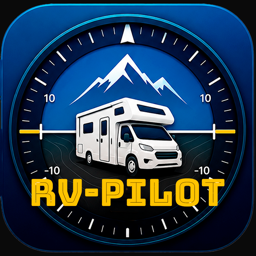

**RV‑Pilot** turns your iPhone into a set of instruments for your camper, van or motorhome: GPS and barometric altitude, speed, heading, pressure, a **parking level with wedge heights**, a **trip log with GPX export** and a **barometric weather trend** – on iPhone, in **CarPlay** and on **Apple Watch**.

**[⬇️ Download on the App Store](https://apps.apple.com/it/app/rv-pilot/id6775754160?l=en-GB)**

## What's new in 2.0

- **New Cockpit screen** – giant GPS altitude, vertical speed, speed, heading, pressure trend and coordinates at a glance
- **Level Assistant** – pitch and roll in degrees and the centimeters of wedge to place under each wheel
- **Phone position** – calibrate the iPhone in its dashboard holder so pitch and roll refer to the vehicle, even when the phone is almost upright
- **Vehicle Profile** – length, width, height, wheelbase, track width and weight of your vehicle, entered once
- **Trip Log** – GPS track, elevation profile, ascent and descent, with GPX export
- **Barometric Trend** – sea‑level pressure over 3, 6 and 24 hours with a spoken weather alert and optional background monitoring
- **Flight Display** – the artificial horizon now has speed and altitude tapes and a heading strip
- **CarPlay** – new Trip Log tab, pressure trend and wedge heights
- **Apple Watch** – new Trend, Level and Trip pages, with start/stop from your wrist
- **Five languages** – English, Italian, German, French and Spanish
- **One menu** – all settings, Help, What's New and About in the ☰ menu at the top right
- **Built‑in Help** – a complete user guide in *Menu › Help & User Guide*

> The analog altimeter dial has been replaced by the new Flight Display.

## Features

| Feature | Free | Pro |
|---|:---:|:---:|
| **Cockpit** – GPS altitude with accuracy, barometric altitude (ISA), pressure, magnetic heading, ground speed, vertical speed, coordinates, units | ✅ | ✅ |
| **CarPlay** and **Apple Watch** | 1 free session | Unlimited |
| **Flight Display** – artificial horizon, speed and altitude tapes, heading strip | – | ✅ |
| **Level Assistant**, **Phone position** calibration and **Vehicle Profile** | – | ✅ |
| **Trip Log** – track, elevation profile, ascent/descent, GPX export | – | ✅ |
| **Barometric Trend** – 3/6/24 h graph, weather alert, background monitoring | – | ✅ |
| **Live Activity** (Lock Screen / Dynamic Island) and **Widgets** | – | ✅ |
| **Voice alerts** and customization | – | ✅ |

RV‑Pilot Pro is a **one‑time purchase** (no subscription). You can buy or restore it in *Menu › RV‑Pilot Pro*.

## Screenshots

### iPhone

  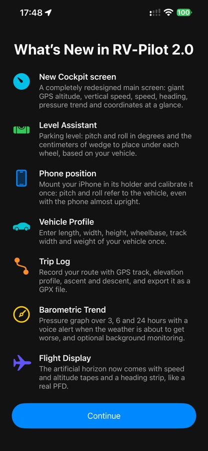
  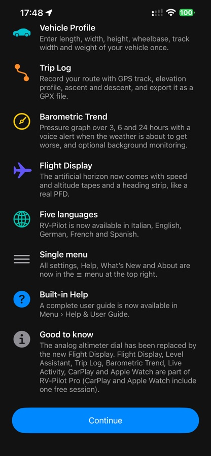
  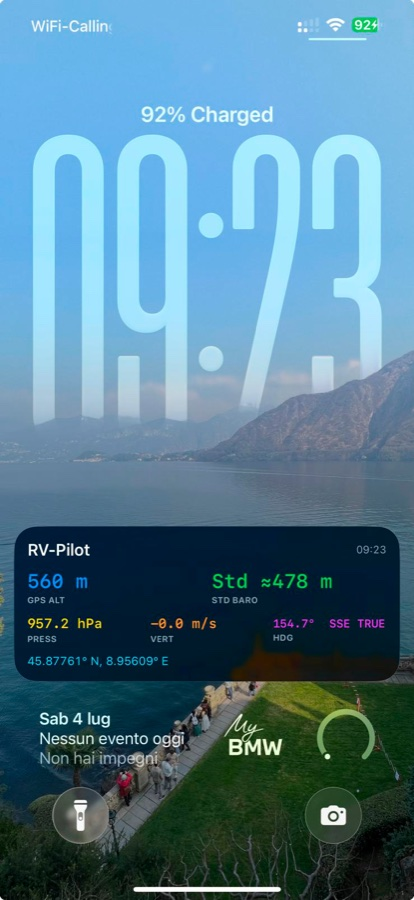

### CarPlay – four tabs

<table>
  <tr>
    <td>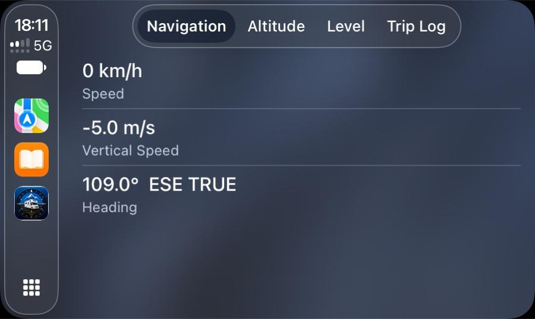 <b>Navigation</b> – speed, vertical speed, heading</td>
    <td>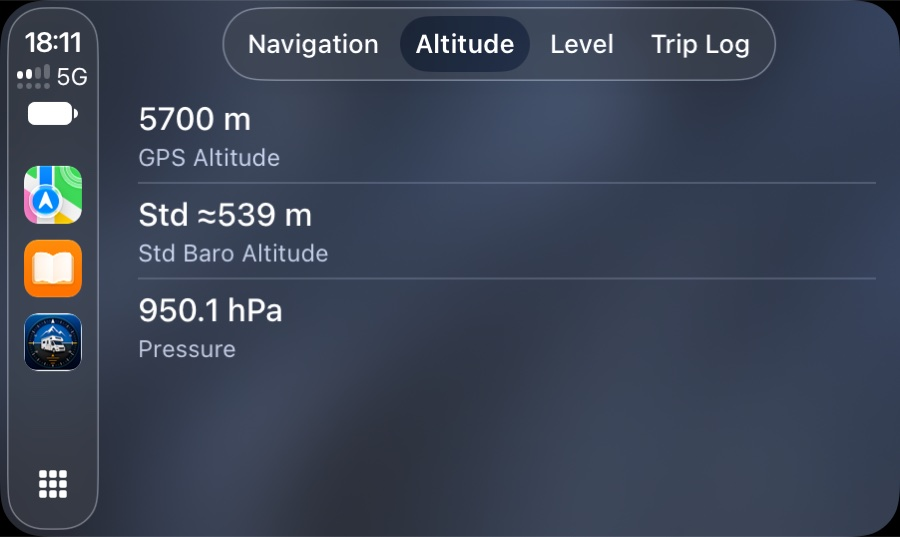 <b>Altitude</b> – GPS, barometric, pressure and trend</td>
  </tr>
  <tr>
    <td>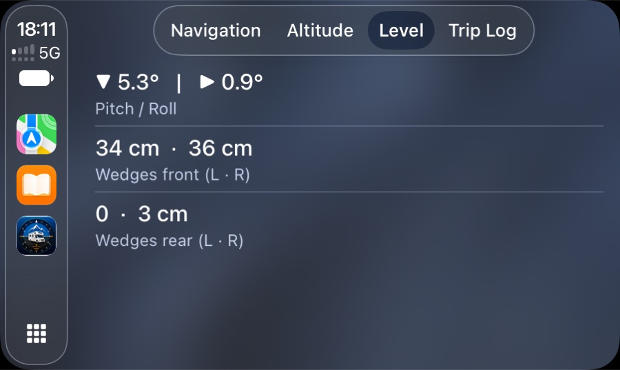 <b>Level</b> – pitch, roll and wedge heights</td>
    <td>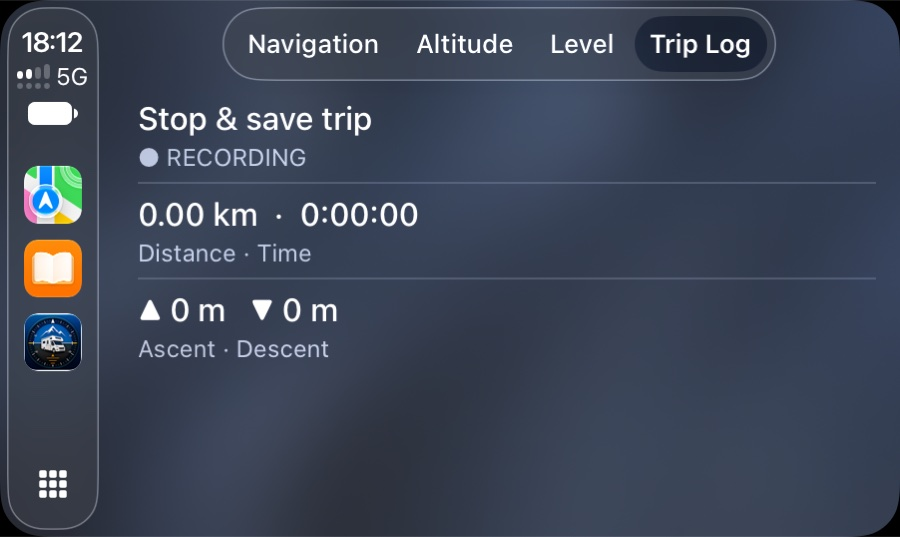 <b>Trip Log</b> – start/stop and live stats</td>
  </tr>
</table>

### Apple Watch

  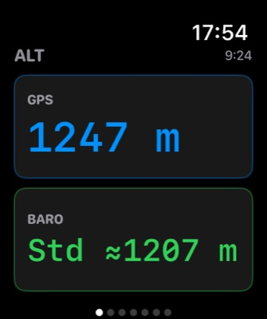
  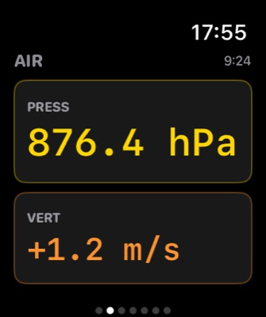
  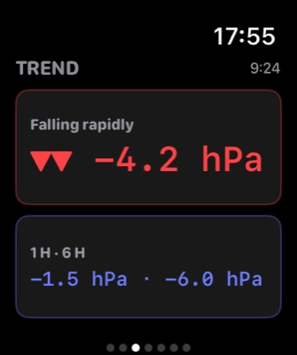
  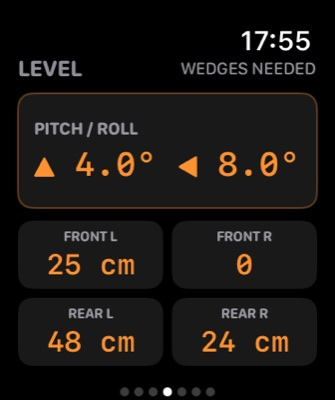
  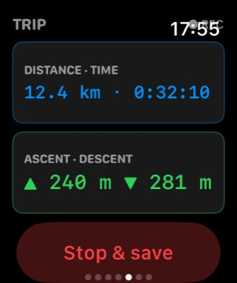

## Getting started

1. Open RV‑Pilot and allow **Location** (GPS altitude, speed, heading) and **Motion** (barometer, pitch and roll).
2. Swipe left and right between the five screens: **Cockpit · Flight Display · Level Assistant · Trip Log · Barometric Trend**.
3. Tap **☰** (top right) for the Menu: Pro, phone position, units, vehicle profile, alerts and voice, Help, What's New and About.

## Using RV‑Pilot

### Cockpit
Your GPS altitude in large digits, with vertical speed (▲ climbing, ▼ descending), vertical accuracy (±) and the altitude change Δ since the last reset. Below: speed, heading (rotating arrow), pressure with its 3‑hour trend, standard barometric altitude and GPS coordinates. **Reset Δ** zeroes the altitude change, **Share** takes a photo with altitude and coordinates overlaid, **Live** starts the Live Activity.

### Flight Display
An aircraft‑style display: artificial horizon (pitch and roll), speed tape on the left, altitude tape on the right and a heading strip on top, with vertical speed, baro altitude, pressure and GPS accuracy below.

### Level Assistant
Place the iPhone flat on the floor or a table of the vehicle, top edge toward the front. The screen shows pitch and roll in degrees and a top view of your vehicle with the **centimeters of wedge** to place under each wheel. A wheel showing **0** is already the highest; below half a degree the screen shows **LEVEL ✓**. Wedge heights use your **Vehicle Profile** (wheelbase and track width) – enter accurate values in *Menu › Vehicle*.

### Phone position (phone in a holder)
Pitch and roll are measured by the phone, so they match the vehicle only if the phone lies flat. If it sits almost upright in a dashboard holder, calibrate it once in *Menu › Phone position* (or the **Phone position** button on the Level screen):
- **Set zero (vehicle level now)** – park on level ground, put the phone in the holder and tap.
- **Guided calibration (any ground)** – 1) phone flat on the floor of the vehicle, top edge to the front → *Capture*; 2) phone in the holder as you use it → *Capture*. Don't move the vehicle between the two steps.

Afterwards the Flight Display, the Level Assistant and CarPlay show the **vehicle's** pitch and roll. *Reset to default* restores the phone‑flat behavior. If you move the holder, calibrate again.

### Trip Log
Tap **Start recording** before you leave. RV‑Pilot saves a point about every 10 m (or every 30 s when stopped), even with the screen off. You see distance, time, speed, total ascent and descent, max altitude and a live elevation profile. **Stop & save trip** opens the stage summary; trips can be renamed, deleted or exported as **GPX**. Ascent/descent ignore changes smaller than 4 m to filter GPS noise. Trips stay on your iPhone.

### Barometric Trend
RV‑Pilot records pressure every minute, adjusts it to **sea level** with your GPS altitude (so driving uphill doesn't fake a drop) and shows the last 3, 6 or 24 hours. The trend uses the 3‑hour change: steady (< 1.6 hPa), rising/falling (1.6–3.5 hPa), rising fast/falling rapidly (> 3.5 hPa). Enable the **pressure drop alert** in *Menu* (default 4 hPa in 3 h, at most once every 3 hours). The iPhone records pressure only while RV‑Pilot runs: for a complete graph while parked, turn on **Monitor in background** on the page (it uses low‑power location, costs some battery and shows the iOS location indicator; don't force‑quit the app).

### Live Activity and Widgets
Tap **Live** on the Cockpit to show altitude on the Lock Screen and in the Dynamic Island. Add the RV‑Pilot widget from the Home Screen or Lock Screen gallery.

### CarPlay
Connect via cable or wirelessly. Four tabs: **Navigation** (speed, vertical speed, heading), **Altitude** (GPS, barometric, pressure with trend), **Level** (pitch, roll, wedge heights front/rear) and **Trip Log** (start/stop and live stats). A **dashboard** scene shows a compact grid of coloured cells. Spoken alerts play through the car speakers. One free CarPlay session is included; unlimited use needs Pro.

### Apple Watch
Pages for altitude, pressure, **trend**, **level with wedge heights** and **trip** (with Start / Stop & save), live from the iPhone (keep the iPhone nearby with RV‑Pilot running). One free Watch session is included; unlimited use needs Pro.

### Voice alerts
Spoken warnings for altitude, speed and a rapid pressure drop, with your own thresholds and messages (use `{value}` where the measured value should be spoken). Choose any installed voice; download premium voices in *iOS Settings › Accessibility › Spoken Content › Voices*.

### Units and language
Metric (m, km/h, hPa), Imperial (ft, mph, inHg) or Nautical (ft, kn, hPa) in the Menu; they apply everywhere – CarPlay, Watch and Live Activity included. The interface follows your iPhone language (English, Italian, German, French, Spanish); to change it for RV‑Pilot only, use *iOS Settings › RV‑Pilot › Language*.

## Troubleshooting

- **"Searching GPS…"** – go outdoors or near a window and wait a few seconds; make sure Location is allowed for RV‑Pilot in iOS Settings.
- **Pitch and roll look wrong** – place the phone flat on a stable surface, or calibrate its position (see above). In a holder, uncalibrated readings follow the phone's tilt, not the vehicle's.
- **Barometric altitude differs from GPS** – it is an estimate based on the standard atmosphere and changes with the weather. Use GPS for absolute height and the barometer for changes.
- **Trip log stops when the phone is locked** – check that Location is set to *While Using the App* or *Always* and that Low Power Mode is off.
- **Pressure graph has gaps** – the iPhone records only while the app runs; turn on *Monitor in background* on the Barometric Trend page.
- **Pro not unlocked after reinstalling** – *Menu › Restore Purchases* with the same Apple ID.

## Privacy

No accounts, no analytics, no advertising, no tracking. Sensor data is processed on your device. Trips and pressure history are stored only on your iPhone and can be deleted at any time. Location is used for GPS altitude, speed and heading, to record trips when you start them and – only if you turn it on – to keep barometer monitoring running while you park. See the [Privacy Policy](https://www.mf-lab.com/RV-Pilot_Privacy-Policy.html).

## Requirements

- An iPhone with GPS, barometer and motion sensors (iPhone 6 or later); the minimum iOS version is listed on the App Store page
- For CarPlay: a compatible car, with a cable or wireless connection
- For the Watch app: a paired Apple Watch

## Support

- Support page: <https://www.mf-lab.com/support/> (also reachable from *Menu › About › Report an Issue*)
- Bug reports and feature requests: open a [GitHub Issue](https://github.com/mk4001/RV-Pilot/issues)

## Built with

UIKit and SwiftUI · CarPlay (tab, list and dashboard scenes) · CoreLocation · CoreMotion (CMAltimeter, device motion) · AVFoundation (speech) · ActivityKit and WidgetKit · WatchConnectivity · StoreKit 2 · Combine

## License

Released under the MIT License – see the [LICENSE](LICENSE) file.
